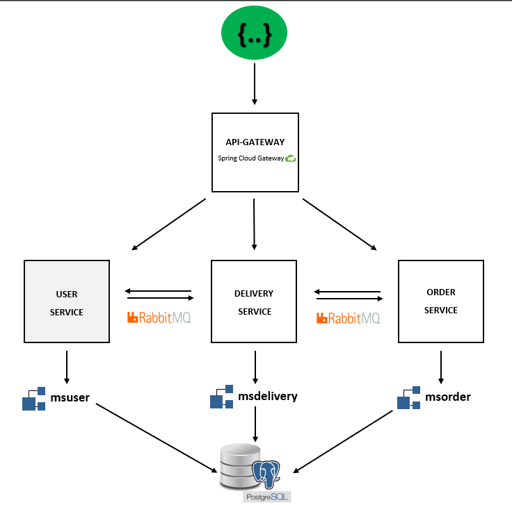

# **PARCEL DELIVERY APP**

This application is a simple parcel delivery application created to demonstrate Microservice Architecture Model using Spring Boot, Spring Cloud, Rabbitmq and Docker.

## **Tech Stack**

* Java 17
* Gradle
* Spring Boot
* Spring Security with JWT Token
* Spring Cloud Gateway
* Rabbitmq
* PostgreSQL
* Docker
* Swagger

## **Architecture**

## **Microservices**

The Parcel Delivery App consists of the following microservices:

### Api-Gateway

The Api-Gateway is implemented using Spring Cloud Gateway and serves as a front door to the Parcel Delivery App. It routes incoming requests to the appropriate microservice based on the request URI.

### User Service

The User Service is responsible for managing user accounts. It provides endpoints for user registration, courier registration and login.

### Order Service

The Order Service is responsible for managing parcel orders. It provides endpoints for creating new orders, updating order status, and retrieving order information.

### Delivery Service

The Delivery Service is responsible for managing parcel delivery operations. It provides endpoints for creating deliveries, updating delivery status, and retrieving delivery information.

### **Prerequisites**

Before running the Parcel Delivery App, make sure you have the following software installed:

* Docker

### **Running the Application**

To run the Parcel Delivery App, follow these steps:
1. Clone the repository: `git clone https://github.com/QafarliTutu/parcel-delivery-app.git`
2. Navigate to the project directory: `cd parcel-delivery-app`
3. Navigate to every module and build the Docker images:
4. `./gradlew build -x test` and `docker build -t api-gateway .`
5. `./gradlew build -x test` and `docker build -t ms-user .`
6. `./gradlew build -x test` and `docker build -t ms-order .`
7. `./gradlew build -x test` and `docker build -t ms-delivery .`
8. Start the Docker containers: `docker-compose up`

The Parcel Delivery App should now be up and running. You can access the Api-Gateway at [http://localhost:8080](https://github.com/QafarliTutu/parcel-delivery-app.git).

### **Users**
username: admin@gmail.com
password: Admin.123
